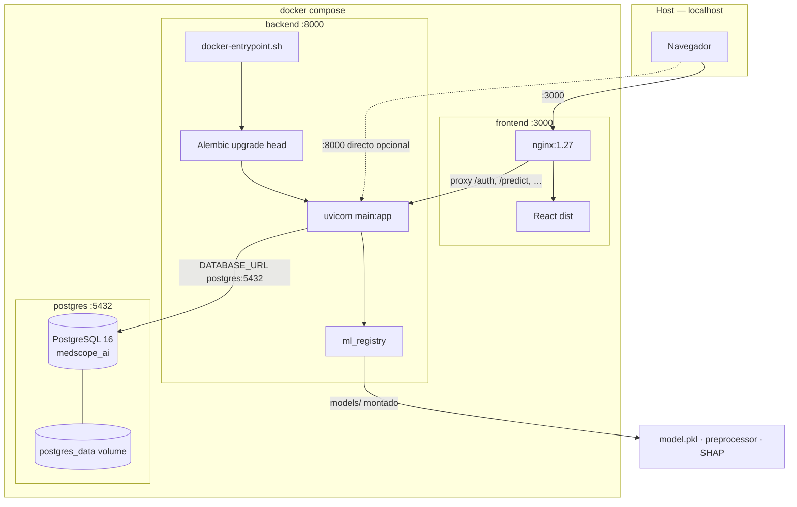
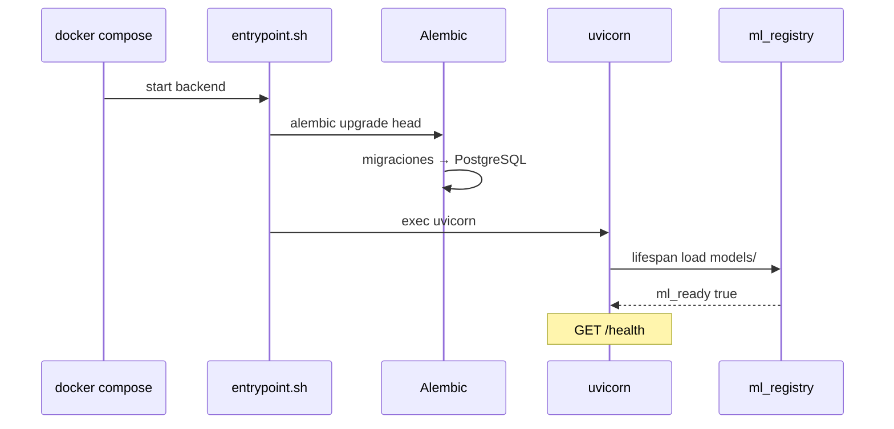
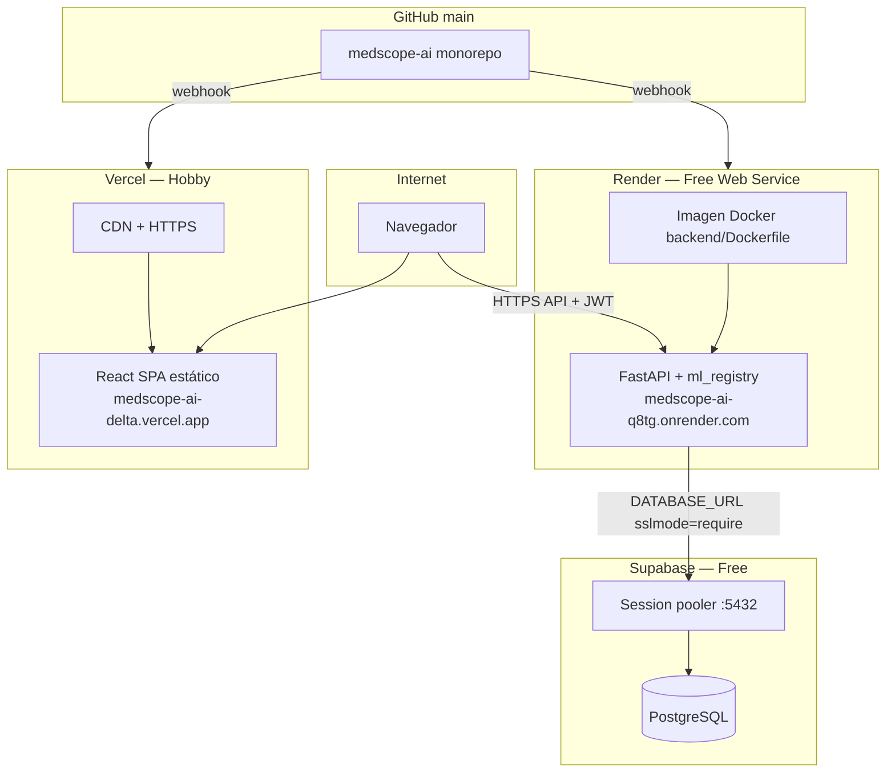
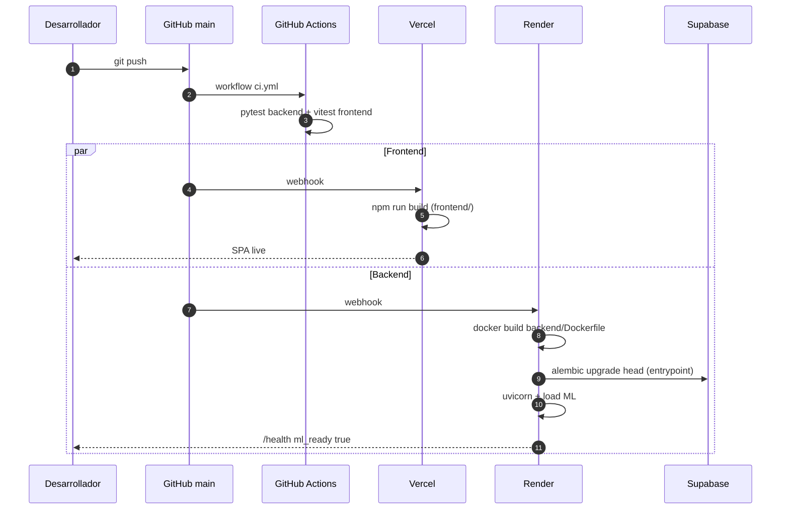
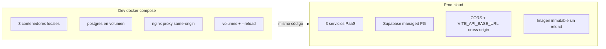
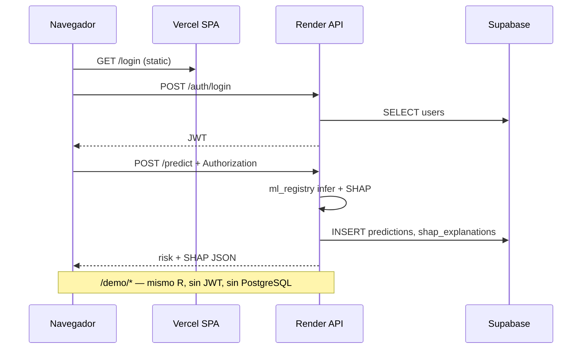

# Diagrama de despliegue — Docker y cloud

Artefacto visual para defensa TFM (**RAC-001**, **T-806**, **RDO-010**, **UC-124**).

**Guía operativa:** [Deployment.md](../Deployment/Deployment.md) · **Arquitectura lógica:** [System-Architecture.md](System-Architecture.md) · **Pipeline ML en imagen:** [ML-Pipeline-Diagram.md](ML-Pipeline-Diagram.md)

---

## 1. Dos entornos, mismo código

MedScope AI sigue **RDO-010**: el código es idéntico; solo cambian variables de entorno y topología de hosting.

| Entorno | Orquestación | PostgreSQL | Frontend | Backend + ML |
|---|---|---|---|---|
| **dev local** | `docker compose` | Contenedor `postgres:16` | Contenedor nginx (puerto 3000) | Contenedor FastAPI (puerto 8000) |
| **prod TFM** | PaaS gestionado | Supabase (managed) | Vercel (static SPA) | Render (Docker image) |

---

## 2. Desarrollo local — `docker-compose.yml`

Tres servicios en la raíz del monorepo. El frontend nginx hace **reverse proxy** al backend en la red interna Docker.



### Servicios y puertos

| Servicio | Imagen / build | Puerto host | Dependencias |
|---|---|---|---|
| `postgres` | `postgres:16-alpine` | `5432` | — |
| `backend` | `backend/Dockerfile` (contexto repo raíz) | `8000` | `postgres` healthy |
| `frontend` | `frontend/Dockerfile` (multi-stage nginx) | `3000` → `80` | `backend` healthy |

### Volúmenes de desarrollo (hot reload)

En dev, el backend monta código fuente y artefactos:

```text
./backend  → /workspace/backend
./ml       → /workspace/ml
./models   → /workspace/models
./datasets → /workspace/datasets
```

Comando backend en compose: `uvicorn … --reload` (no en producción Render).

### Arranque del contenedor backend



---

## 3. Build de imagen backend (`backend/Dockerfile`)

Contexto de build: **raíz del repositorio** (igual en `docker compose` y Render).

```mermaid
flowchart LR
  subgraph context [Build context — repo root]
    REQ_B[backend/requirements.txt]
    REQ_M[ml/requirements.txt]
    CODE_B[backend/]
    CODE_M[ml/]
    MODELS[models/ — 4 artefactos]
    ENTRY[docker-entrypoint.sh]
  end

  subgraph image [Imagen python:3.11-slim]
    PIP[pip install backend + ml deps]
    COPY_CODE[COPY backend + ml]
    COPY_ML[COPY models/]
    VALIDATE[RUN test 4 archivos]
    WORKDIR[/workspace/backend]
  end

  REQ_B & REQ_M --> PIP
  CODE_B & CODE_M --> COPY_CODE
  MODELS --> COPY_ML --> VALIDATE
  ENTRY --> image
  PIP --> COPY_CODE --> COPY_ML
```

### Artefactos ML obligatorios en build

El `RUN test` falla el build si falta alguno:

| Archivo | Generación |
|---|---|
| `models/model.pkl` | `python ml/scripts/serialize_model.py` |
| `models/preprocessor.pkl` | idem |
| `models/model_manifest.json` | idem |
| `models/shap_background.npy` | idem |

Script auxiliar: `scripts/prepare-docker-build.ps1`.

---

## 4. Frontend Docker (dev compose)

Build multi-stage: Node 22 → nginx sirve `dist/`.

| Stage | Acción |
|---|---|
| `build` | `npm ci` + `npm run build` (Vite) |
| `runtime` | nginx + `frontend/nginx.conf` |

En compose, nginx proxifica rutas API (`/auth/`, `/predict`, `/demo/`, …) a `http://backend:8000`. Las rutas React usan `try_files` → `index.html` (SPA).

En **Vercel (prod)** no hay nginx: el navegador llama al API Render vía `VITE_API_BASE_URL`.

---

## 5. Producción — Supabase + Render + Vercel

Stack gratuito desplegado para el TFM (UC-124).



### URLs de producción

| Componente | URL |
|---|---|
| Frontend | https://medscope-ai-delta.vercel.app |
| Backend API | https://medscope-ai-q8tg.onrender.com |
| Health | https://medscope-ai-q8tg.onrender.com/health |
| Swagger | https://medscope-ai-q8tg.onrender.com/docs |

### Variables críticas

| Servicio | Variable | Propósito |
|---|---|---|
| Render | `DATABASE_URL` | Conexión Supabase (pooler 5432) |
| Render | `JWT_SECRET` | Firma tokens |
| Render | `CORS_ORIGINS` | Origen Vercel exacto |
| Render | `PYTHONPATH=/workspace` | Imports backend + ml |
| Vercel | `VITE_API_BASE_URL` | URL Render (build time) |

---

## 6. CI/CD — push a `main`

GitHub Actions valida; Vercel y Render despliegan en paralelo.



| Cambio en repo | Efecto |
|---|---|
| `frontend/**` | Rebuild Vercel |
| `backend/**`, `ml/**`, `models/`, Dockerfile | Rebuild Render |
| Nueva migración Alembic | Aplicada al arrancar Render |
| `docs/**` solo | Sin impacto runtime |

CI (`.github/workflows/ci.yml`) **no despliega** — solo tests.

---

## 7. Comparativa dev vs prod



| Aspecto | Dev (`docker compose`) | Prod (cloud) |
|---|---|---|
| PostgreSQL | `postgres:16-alpine` local | Supabase Session pooler |
| API host | `backend:8000` / `localhost:8000` | `*.onrender.com` |
| Frontend | nginx `:3000` con proxy | Vercel CDN |
| ML artifacts | Volume `./models` o en imagen | Copiados en imagen Docker |
| Migraciones | entrypoint al start | entrypoint en cada deploy Render |
| CORS | `localhost:5173,3000` | URL Vercel única |
| Cold start | No | Render free ~30–90 s tras inactividad |

---

## 8. Flujo de petición en producción



---

## 9. Archivos de despliegue

| Archivo | Rol |
|---|---|
| `docker-compose.yml` | Orquestación dev (postgres + backend + frontend) |
| `backend/Dockerfile` | Imagen producción API + ML |
| `backend/docker-entrypoint.sh` | Alembic + exec uvicorn |
| `frontend/Dockerfile` | Build Vite + nginx (dev compose) |
| `frontend/nginx.conf` | Proxy API en red Docker |
| `frontend/vercel.json` | SPA rewrites en Vercel |
| `.github/workflows/ci.yml` | Tests en push/PR |
| `scripts/prepare-docker-build.ps1` | Validar artefactos ML pre-build |

---

## 10. Trazabilidad

| Requisito / UC | Cobertura |
|---|---|
| RDO-010 dev/prod mismo código | §1, §7 |
| RDO-020 secretos fuera de git | §5 variables dashboards |
| RDO-030 Docker | §2–4 |
| UC-124 cloud deployment | §5–6 |
| RAC-001 arquitectura despliegue | Este documento |
| T-012–013 Docker local | §2 |
| T-709–718 cloud deploy | §5–6 |
| T-806 | Este documento |

---

*Última actualización: T-806 — julio 2026.*
