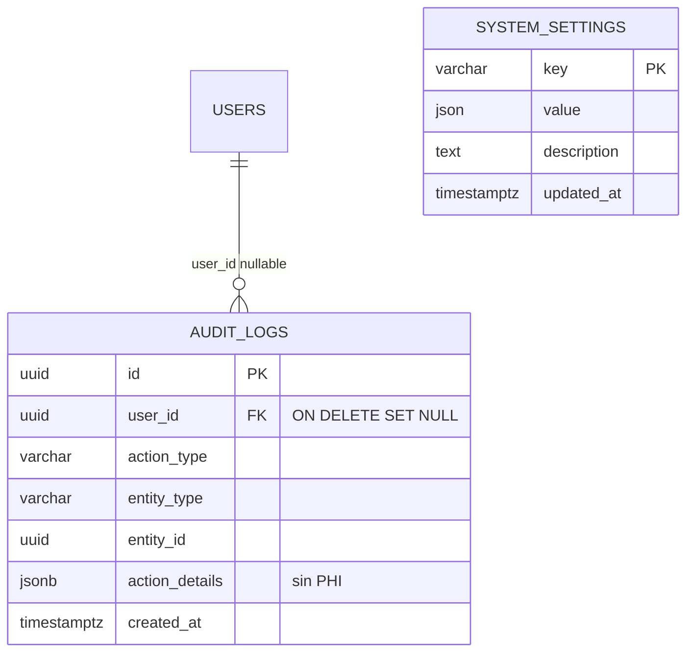
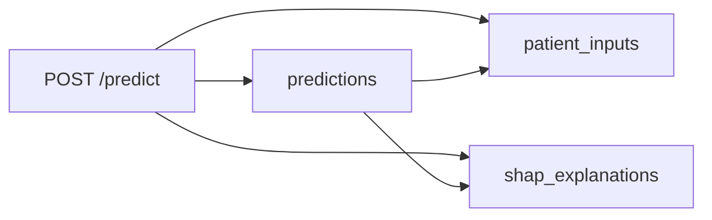
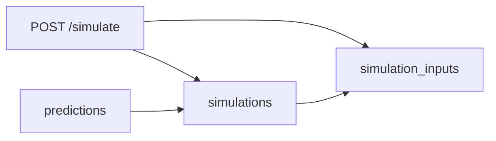

# Diagrama entidad-relación (ER) — PostgreSQL

Artefacto visual para defensa TFM (**RAC-001**, **T-805**).

**Esquema narrativo:** [Database.md](../Database/Database.md) · **Arquitectura sistema:** [System-Architecture.md](System-Architecture.md) · **Flujos UC:** [Sequence-Diagrams.md](Sequence-Diagrams.md)

---

## 1. Vista ER — tablas MVP

Modelo relacional en **3NF**. Claves primarias **UUID** (`gen_random_uuid()`). Acceso solo vía **repositories** (RDB-020).

```mermaid
erDiagram
    ROLES ||--o{ USERS : "role_id"
    USERS ||--o{ PREDICTIONS : "user_id"
    USERS ||--o{ SIMULATIONS : "user_id"
    PREDICTIONS ||--|| PATIENT_INPUTS : "prediction_id UK"
    PREDICTIONS ||--o{ SHAP_EXPLANATIONS : "prediction_id"
    PREDICTIONS ||--o{ SIMULATIONS : "prediction_id"
    SIMULATIONS ||--o{ SIMULATION_INPUTS : "simulation_id"

    ROLES {
        uuid id PK
        varchar name UK "admin, clinician, analyst, nurse"
        text description
        json permissions "opcional RBAC"
    }

    USERS {
        uuid id PK
        uuid role_id FK
        varchar first_name
        varchar last_name
        varchar email UK
        text password_hash "bcrypt"
        boolean is_active
        timestamptz created_at
        timestamptz updated_at
    }

    PREDICTIONS {
        uuid id PK
        uuid user_id FK
        numeric risk_score "0-100 en BD"
        varchar risk_level "low | medium | high"
        numeric confidence_score
        text summary "RF-032"
        varchar model_version
        int prediction_time_ms
        timestamptz created_at
    }

    PATIENT_INPUTS {
        uuid id PK
        uuid prediction_id FK UK
        int age
        varchar gender
        numeric glucose
        numeric blood_pressure
        int medications_count
        int previous_admissions
        int hospital_stay_days
        numeric bmi
        timestamptz created_at
    }

    SHAP_EXPLANATIONS {
        uuid id PK
        uuid prediction_id FK
        varchar feature_name
        varchar feature_value
        numeric shap_value
        varchar direction
        varchar impact_direction
        int importance_rank
    }

    SIMULATIONS {
        uuid id PK
        uuid prediction_id FK
        uuid user_id FK
        numeric original_risk
        numeric simulated_risk
        numeric delta_risk
        text simulation_summary
        timestamptz created_at
    }

    SIMULATION_INPUTS {
        uuid id PK
        uuid simulation_id FK
        varchar feature_name
        varchar original_value
        varchar simulated_value
    }
```

### Cardinalidades

| Relación | Tipo | Notas |
|---|---|---|
| `roles` → `users` | 1:N | Cada usuario tiene un rol (RF-004) |
| `users` → `predictions` | 1:N | Autor de la evaluación clínica |
| `predictions` → `patient_inputs` | 1:1 | Inputs de-identificados (RNF-034) |
| `predictions` → `shap_explanations` | 1:N | Top features SHAP por predicción |
| `predictions` → `simulations` | 1:N | What-if sobre una predicción base |
| `users` → `simulations` | 1:N | Usuario que ejecutó la simulación |
| `simulations` → `simulation_inputs` | 1:N | Variables modificadas en el escenario |

---

## 2. Tablas opcionales (post-MVP)

No forman parte del flujo crítico MVP, pero están documentadas o implementadas para extensiones.



| Tabla | Estado | Referencia |
|---|---|---|
| `audit_logs` | Modelo ORM + plan T-X06 | UC-081, UC-085, RBE-016 |
| `system_settings` | Modelo ORM | UC-071, T-X02 |
| `analytics_snapshots` | No implementada | Analytics MVP = agregaciones sobre `predictions` |
| `user_sessions` | No requerida | JWT stateless (RF-003) |

---

## 3. Árbol jerárquico (resumen)

Equivalente a [Database.md §3](../Database/Database.md#3-modelo-de-entidades):

```text
roles
 └── users
       ├── predictions
       │      ├── patient_inputs      (1:1)
       │      ├── shap_explanations   (1:N)
       │      └── simulations
       │             └── simulation_inputs (1:N)
       ├── simulations                (también FK directa user_id)
       └── audit_logs                 (opcional)
```

---

## 4. Flujos de persistencia

### 4.1 Predicción (UC-022–023)



```text
POST /predict
  → INSERT predictions + patient_inputs
  → inferencia ML + SHAP (sin retrain)
  → INSERT shap_explanations (N filas)
  → COMMIT
  → JSON: risk_score 0–1, risk_percent 0–100
```

**Nota:** `predictions.risk_score` en BD almacena **porcentaje 0–100**; la API normaliza con `services/risk_format.py`.

### 4.2 Simulación (UC-040–044)



### 4.3 Historial y analytics (sin tablas extra)

| Endpoint | Tablas consultadas |
|---|---|
| `GET /history` | `predictions` JOIN `patient_inputs` (+ filtros RF-051) |
| `GET /analytics` | Agregaciones sobre `predictions` (COUNT, AVG, GROUP BY `risk_level`) |

### 4.4 Demo público (UC-066)

`POST /demo/predict` y `POST /demo/simulate` **no persisten** en PostgreSQL — mismo modelo ML, sin escritura en estas tablas.

---

## 5. Índices principales

| Índice | Tabla | Columna(s) | Uso |
|---|---|---|---|
| `idx_users_email` | `users` | `email` | Login |
| `idx_predictions_user` | `predictions` | `user_id` | Historial por clínico |
| `idx_predictions_created` | `predictions` | `created_at DESC` | Orden cronológico |
| `idx_predictions_risk_level` | `predictions` | `risk_level` | Filtro RF-051 |
| `idx_shap_explanations_prediction` | `shap_explanations` | `prediction_id` | Carga explicaciones |
| `idx_simulations_prediction` | `simulations` | `prediction_id` | Simulaciones de una evaluación |
| `idx_simulation_inputs_simulation` | `simulation_inputs` | `simulation_id` | Detalle what-if |

---

## 6. Mapeo ORM ↔ tablas

| Tabla | Modelo SQLAlchemy |
|---|---|
| `roles` | `backend/models/role.py` |
| `users` | `backend/models/user.py` |
| `predictions` | `backend/models/prediction.py` |
| `patient_inputs` | `backend/models/patient_input.py` |
| `shap_explanations` | `backend/models/shap_explanation.py` |
| `simulations` | `backend/models/simulation.py` |
| `simulation_inputs` | `SimulationInput` en `simulation.py` |
| `audit_logs` | `backend/models/audit_log.py` |
| `system_settings` | `backend/models/system_setting.py` |

Migraciones: `backend/alembic/versions/`.

---

## 7. Trazabilidad

| Requisito / UC | Cobertura |
|---|---|
| RDB-001, RDB-010, RDB-020 | §1, Database.md |
| RF-004 roles | `roles` seed |
| RF-050–052 historial | `predictions` + índices |
| RF-030–032 SHAP | `shap_explanations`, `predictions.summary` |
| RF-042 simulación | `simulations`, `simulation_inputs` |
| RNF-034 sin PHI | `patient_inputs` de-identificados |
| UC-023 | §4.1 |
| UC-044 | §4.2 |
| UC-050–052 | §4.3 |
| UC-081 | `audit_logs` §2 |
| T-805 | Este documento |

---

*Última actualización: T-805 — julio 2026.*
