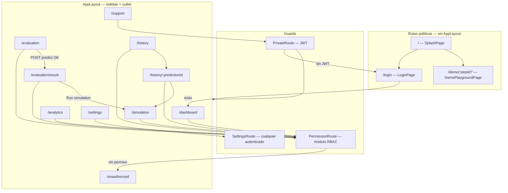
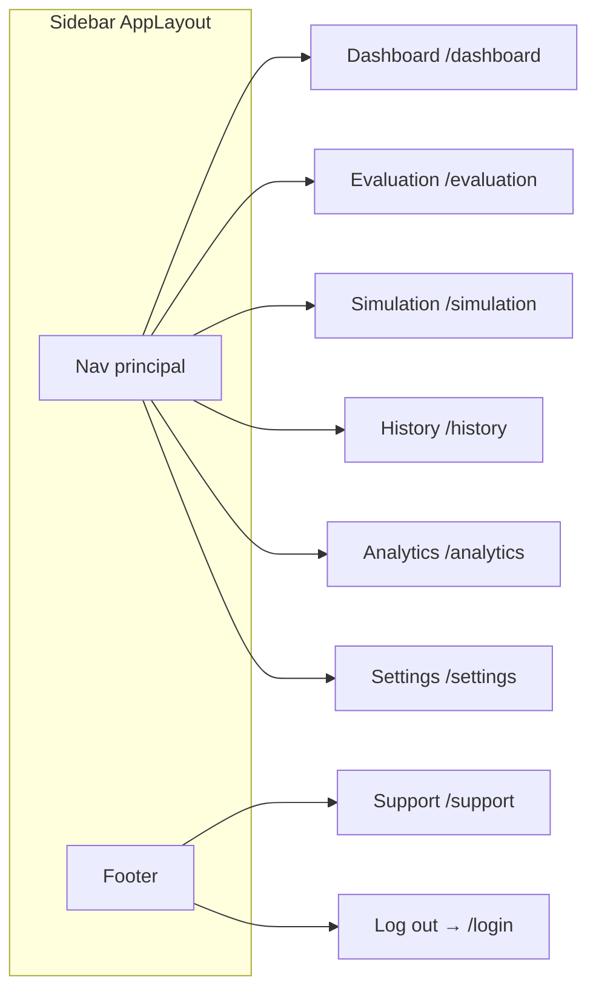
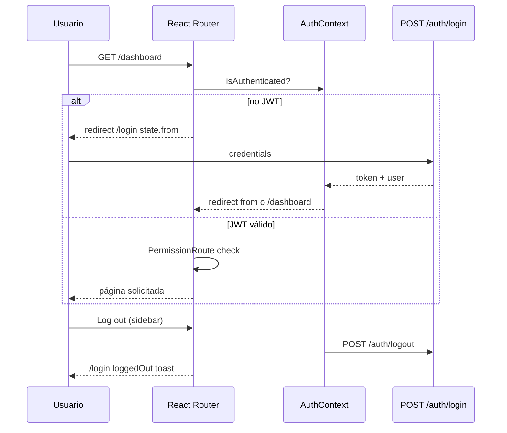

# Diagrama de navegación frontend — React Router

Artefacto visual para defensa TFM (**RAC-001**, **T-807**, **RFW-010**).

**Código fuente:** [`frontend/src/App.tsx`](../../frontend/src/App.tsx) · [`frontend/src/config/navigation.ts`](../../frontend/src/config/navigation.ts) · **Diseño:** [Design/screens](../Design/screens/README.md)

---

## 1. Árbol de rutas

React Router v6 con rutas **públicas**, **autenticadas** (layout con sidebar) y **guards** por módulo RBAC.



Ruta comodín: `*` → redirige a `/` (splash).

---

## 2. Sidebar — ítems de navegación

Definidos en `APP_NAV_ITEMS` + footer **Support** (`SUPPORT_NAV_ITEM`).



| Ítem | Ruta | Módulo RBAC | Icono |
|---|---|---|---|
| Dashboard | `/dashboard` | `dashboard` | LayoutDashboard |
| Evaluation | `/evaluation` | `evaluation` | Stethoscope |
| Simulation | `/simulation` | `simulation` | FlaskConical |
| History | `/history` | `history` | History |
| Analytics | `/analytics` | `analytics` | BarChart3 |
| Settings | `/settings` | `settings` * | Settings |
| Support | `/support` | — (todos autenticados) | LifeBuoy |

\* **Settings** aparece en sidebar para **todo usuario autenticado** (`getNavItemsForUser` fuerza el ítem). La ruta usa `SettingsRoute` (solo requiere login). Secciones internas dependen del rol (§4).

---

## 3. Matriz RBAC — rutas por rol

Permisos por defecto: `DEFAULT_ROLE_PERMISSIONS` en [`types/permissions.ts`](../../frontend/src/types/permissions.ts).

| Ruta | admin | clinician | analyst | nurse |
|---|---|---|---|---|
| `/dashboard` | ✅ | ✅ | ✅ | ✅ |
| `/evaluation` | ✅ | ✅ | ❌ → `/unauthorized` | ❌ |
| `/evaluation/result` | ✅ | ✅ | ❌ | ❌ |
| `/simulation` | ✅ | ✅ | ❌ | ❌ |
| `/history` | ✅ | ✅ | ❌ | ✅ |
| `/history/:id` | ✅ | ✅ | ❌ | ✅ |
| `/analytics` | ✅ | ❌ | ✅ | ❌ |
| `/settings` | ✅ | ✅ | ✅ | ✅ |
| `/support` | ✅ | ✅ | ✅ | ✅ |

**Guards:**

| Componente | Comportamiento |
|---|---|
| `PrivateRoute` | Sin JWT → `/login` (guarda `from` para redirect) |
| `PermissionRoute` | Sin módulo → `/unauthorized` |
| `SettingsRoute` | Solo exige autenticación |

---

## 4. Settings — secciones por rol

`SettingsPage` muestra paneles según permisos (no rutas hijas separadas).

| Sección | admin | clinician | analyst | nurse |
|---|---|---|---|---|
| Appearance | ✅ | ✅ | ✅ | ✅ |
| User management | ✅ | ❌ | ❌ | ❌ |
| Role policies | ✅ | ❌ | ❌ | ❌ |
| System configuration | ✅ | ❌ | ❌ | ❌ |
| Audit | ✅ | ❌ | ❌ | ❌ |
| Models (ML comparison) | ✅ | ❌ | ✅ | ❌ |

---

## 5. Flujo clínico MVP (wow path)

Recorrido principal del CDSS tras login como **clinician**.

```mermaid
flowchart LR
  L[/login] --> D[/dashboard]
  D --> E[/evaluation]
  E -->|Generate prediction| R[/evaluation/result]
  R -->|SHAP + gauge| R
  R -->|Run simulation| S[/simulation]
  S -->|Recalculate| S
  R -->|New evaluation| E
  D --> H[/history]
  H -->|fila / alerta| HD[/history/:id]
  HD -->|Simulate from history| S
```

**Estado en router (no en URL):**

| Transición | Estado |
|---|---|
| `evaluation` → `evaluation/result` | `{ result, baselineRequest }` |
| `result` → `simulation` | `buildSimulationLocationState` + `resetDraft: true` |
| `history/:id` → `simulation` | contexto de predicción histórica |

Si se accede a `/evaluation/result` sin estado → redirect a `/evaluation`.

---

## 6. Entrada pública — splash y demo

### 6.1 Splash (`/`)

```mermaid
flowchart TB
  SPLASH[SplashPage /]
  SPLASH -->|Sign in| LOGIN[/login]
  SPLASH -->|Explore demo| DEMO[/demo]
  SPLASH --> FEAT[Feature cards — modal detalle]
```

### 6.2 Demo guiado (`/demo/:stepId?`) — UC-066

Sin login. Pasos sincronizados con la URL (back/forward del navegador).

```mermaid
flowchart LR
  W["/demo — welcome"]
  C["/demo/case"]
  P["/demo/predict"]
  X["/demo/explain"]
  S["/demo/simulate"]
  D["/demo/complete"]

  W --> C --> P --> X --> S --> D
  D -->|Sign in| LOGIN[/login]
```

| stepId | Pantalla |
|---|---|
| `welcome` | Introducción tour |
| `case` | Caso sintético alto riesgo |
| `predict` | Predicción AI en vivo |
| `explain` | Factores SHAP |
| `simulate` | What-if |
| `complete` | CTA a login |

API: `POST /demo/predict`, `POST /demo/simulate` (sin JWT, sin PostgreSQL).

---

## 7. Flujo de autenticación



Login exitoso: redirect a `location.state.from` o **`/dashboard`** por defecto.

---

## 8. Mapa completo de pantallas

| Ruta | Componente | Auth | Layout |
|---|---|---|---|
| `/` | `SplashPage` | No | — |
| `/login` | `LoginPage` | No | — |
| `/demo`, `/demo/:stepId` | `DemoPlaygroundPage` | No | Demo shell |
| `/dashboard` | `DashboardPage` | Sí | AppLayout |
| `/evaluation` | `EvaluationPage` | Sí | AppLayout |
| `/evaluation/result` | `PredictionResultPage` | Sí | AppLayout |
| `/simulation` | `SimulationPage` | Sí | AppLayout |
| `/history` | `HistoryPage` | Sí | AppLayout |
| `/history/:predictionId` | `HistoryDetailPage` | Sí | AppLayout |
| `/analytics` | `AnalyticsPage` | Sí | AppLayout |
| `/settings` | `SettingsPage` | Sí | AppLayout |
| `/support` | `SupportPage` | Sí | AppLayout |
| `/unauthorized` | `UnauthorizedPage` | Sí | AppLayout |

**SPA en Vercel:** [`frontend/vercel.json`](../../frontend/vercel.json) reescribe todas las rutas a `index.html`.

---

## 9. Enlaces transversales (CTA)

| Origen | Destino | Trigger |
|---|---|---|
| Dashboard activity | `/history/:id` | Alertas / actividad reciente |
| Dashboard | `/history` | “View full log” |
| History table | `/history/:id` | Fila evaluación |
| History detail | `/simulation` | Simular desde histórico |
| Prediction result | `/simulation` | Run simulation |
| Prediction result | `/evaluation` | New evaluation |
| Simulation (sin contexto) | `/evaluation` | Go to evaluation |
| Unauthorized | `/dashboard` | Volver |
| Demo complete | `/login` | Sign in |

---

## 10. Trazabilidad

| Requisito / UC | Cobertura |
|---|---|
| RAC-001 navegación MVP | §1–2, §8 |
| RFW-010 splash + demo | §6 |
| RF-012 support | `/support` footer |
| UC-001 login | §7 |
| UC-020–030 evaluación + SHAP | §5 |
| UC-040–044 simulación | §5 |
| UC-050–052 historial | §5, §9 |
| UC-060–062 analytics | §3 |
| UC-066 demo público | §6.2 |
| RTS-020 route guards | `PrivateRoute`, `PermissionRoute` |
| T-807 | Este documento |

---

*Última actualización: T-807 — julio 2026.*
