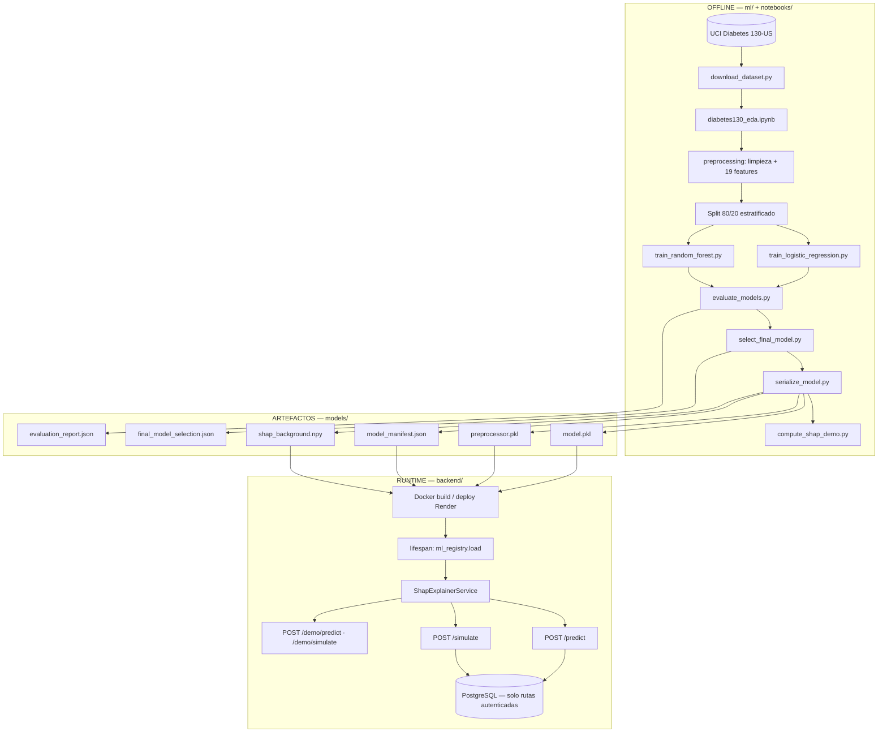
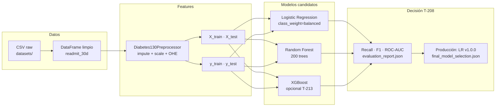
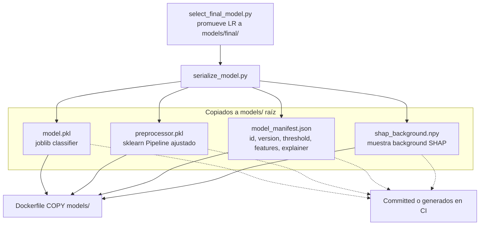
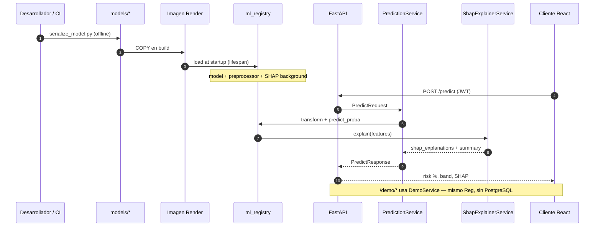

# Diagrama del pipeline ML — train → serialize → infer

Artefacto visual para defensa TFM (**RAC-001**, **T-804**).

**Narrativa completa:** [ML-Pipeline.md](../ML/ML-Pipeline.md) · **Arquitectura sistema:** [System-Architecture.md](System-Architecture.md) · **Secuencia inferencia:** [Sequence-Diagrams.md §2](Sequence-Diagrams.md#2-clinical-prediction--shap-uc-020--uc-030)

---

## 1. Vista end-to-end

El pipeline se divide en **dos fases estrictas**: entrenamiento offline (nunca en petición HTTP) e inferencia en runtime (backend FastAPI).



---

## 2. Fase offline — entrenamiento y selección



| Paso | Script | Salida |
|---|---|---|
| Descarga | `ml/scripts/download_dataset.py` | CSV + `datasets/manifest.json` |
| Entrenamiento LR | `ml/scripts/train_logistic_regression.py` | `models/logistic_regression/` |
| Entrenamiento RF | `ml/scripts/train_random_forest.py` | `models/random_forest/` |
| Evaluación | `ml/scripts/evaluate_models.py` | `models/evaluation_report.json` |
| Selección | `ml/scripts/select_final_model.py` | `models/final/`, `final_model_selection.json` |
| Serialización | `ml/scripts/serialize_model.py` | `model.pkl`, `preprocessor.pkl`, `model_manifest.json`, `shap_background.npy` |

**Modelo en producción:** Logistic Regression — mayor **recall** (0,54) frente a RF (0,20) y XGBoost (0,44) en test hold-out.

---

## 3. Fase serialize — artefactos de producción



| Artefacto | Uso en runtime |
|---|---|
| `model.pkl` | `predict_proba` → risk_score |
| `preprocessor.pkl` | Paridad train/inference (RIA-010) |
| `model_manifest.json` | Versión expuesta en API, umbral, lista de features |
| `shap_background.npy` | `LinearExplainer` sin dataset en contenedor |

Validación en build Docker:

```dockerfile
RUN test -f /workspace/models/model.pkl && ...
```

---

## 4. Fase infer — runtime backend



### Reglas de inferencia (RIA-021)

| Regla | Implementación |
|---|---|
| Carga única al arranque | `backend/core/ml_registry.py` + `lifespan` en `main.py` |
| Sin reentrenamiento online | Solo `predict` / `predict_proba` |
| SHAP en producción | `LinearExplainer` + `shap_background.npy` |
| Latencia objetivo | &lt; 1 s (`prediction_time_ms`) |
| Health check | `GET /health` → `ml_ready: true` |

### Endpoints que usan el mismo modelo

| Endpoint | Persistencia | Auth |
|---|---|---|
| `POST /predict` | Sí → PostgreSQL | JWT |
| `POST /simulate` | Sí | JWT |
| `POST /demo/predict` | No | Público |
| `POST /demo/simulate` | No | Público |

---

## 5. Comandos reproducibles (orden)

```bash
# 1. Offline — una vez por versión de modelo
python ml/scripts/download_dataset.py
python ml/scripts/train_logistic_regression.py
python ml/scripts/train_random_forest.py
python ml/scripts/evaluate_models.py
python ml/scripts/select_final_model.py
python ml/scripts/serialize_model.py

# 2. Validación
pytest ml/tests -v
pytest backend/tests/test_demo.py -v   # inferencia efímera

# 3. Deploy — artefactos en imagen Docker → Render
# Ver Deployment.md §5
```

---

## 6. Trazabilidad

| Requisito | Sección |
|---|---|
| RAC-001 pipeline ML | §1–4 |
| RAC-010 metodología y resultados | [ML-Pipeline.md §2–6](../ML/ML-Pipeline.md) |
| RIA-010 paridad preprocess | §3 |
| RIA-020 serialización | §3 |
| RIA-021 inferencia sin retrain | §4 |
| RIA-030 SHAP | §4 |
| UC-082 load model at startup | §4 |
| UC-110–112 ML lifecycle | §2 |
| T-209 serialize | §3 |
| T-301 ml_registry | §4 |

---

*Última actualización: T-804 — julio 2026.*
