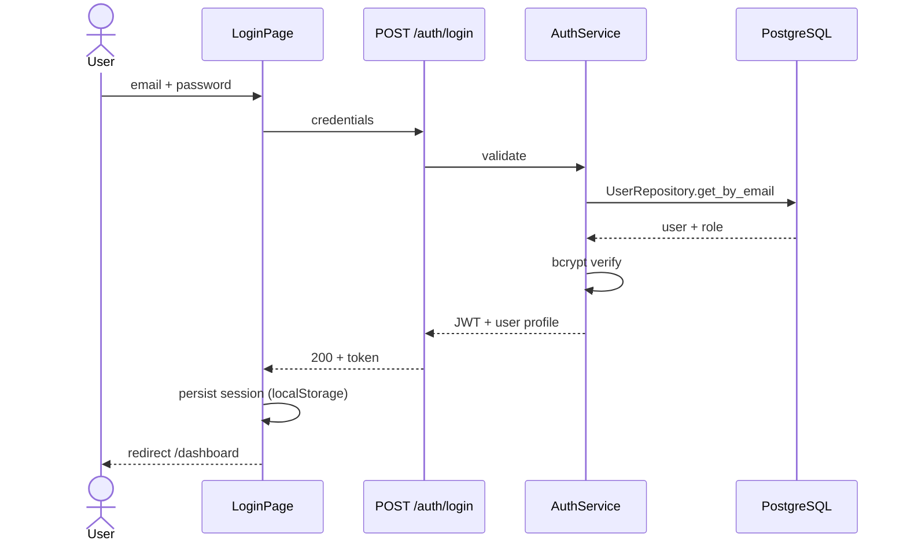
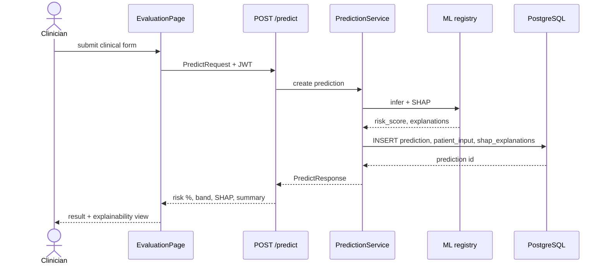
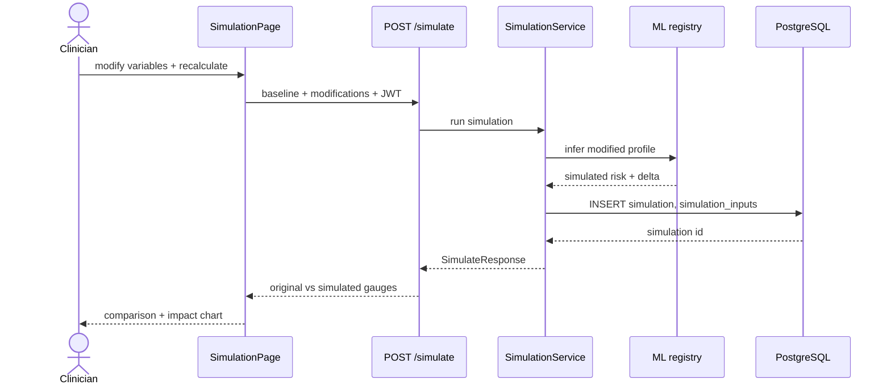
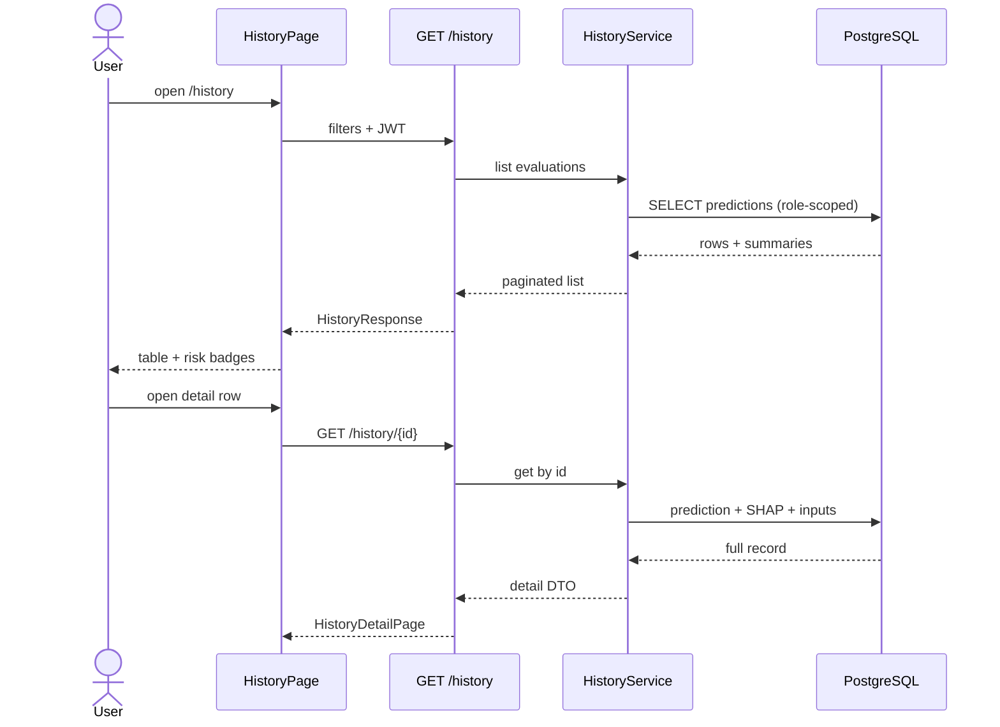
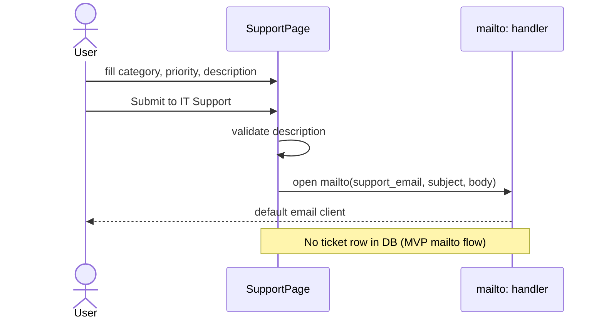
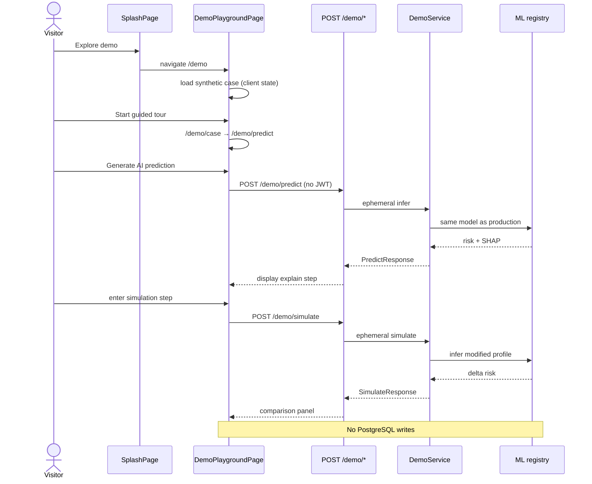

# Sequence diagrams — critical flows

UML-style **sequence diagrams** (Mermaid) for thesis defense and RAC-001 traceability.

**Task:** T-811 · **Related:** [Use Cases](../Use%20Cases/Use%20Cases.md) · [ML inference §8.2](../ML/ML-Pipeline.md#82-diagrama-de-inferencia-integración-backend)

---

## Index

| # | Flow | Use cases | Persistence |
|---|---|---|---|
| 1 | [Login](#1-login-uc-001) | UC-001 | JWT client-side |
| 2 | [Prediction + SHAP](#2-clinical-prediction--shap-uc-020--uc-030) | UC-020, UC-030, UC-023 | PostgreSQL |
| 3 | [Clinical simulation](#3-clinical-simulation-uc-040--uc-043) | UC-040, UC-043, UC-044 | PostgreSQL |
| 4 | [Prediction history](#4-prediction-history-uc-052) | UC-052 | Read-only |
| 5 | [Support ticket](#5-support-ticket-uc-065) | UC-065 | Mailto (no DB) |
| 6 | [Public explore demo](#6-public-explore-demo-uc-066) | UC-066 | None (ephemeral) |

Other diagrams: [ML inference](ML-Pipeline-Diagram.md) · [Deployment / CI/CD](Deployment-Diagram.md) · [ER](ER-Diagram.md) · [Frontend navigation](Frontend-Navigation.md)

---

## 1. Login (UC-001)

---

## 2. Clinical prediction + SHAP (UC-020 · UC-030)

---

## 3. Clinical simulation (UC-040 · UC-043)

---

## 4. Prediction history (UC-052)

---

## 5. Support ticket (UC-065)

---

## 6. Public explore demo (UC-066)

---

*Last updated: T-811 — Fase 8 documentation (jul 2026).*
