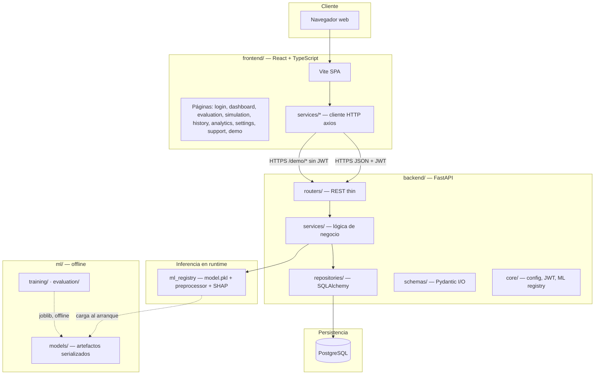
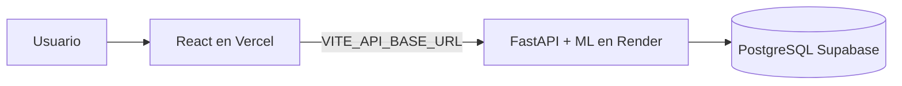

# Arquitectura del sistema — MedScope AI

Diagrama de componentes para defensa TFM (**RAC-001**, **T-803**).

**Relacionado:** [Sequence-Diagrams.md](Sequence-Diagrams.md) (flujos UC) · [Frontend-Navigation.md](Frontend-Navigation.md) (rutas y RBAC, T-807) · [Deployment-Diagram.md](Deployment-Diagram.md) (Docker + cloud, T-806) · [Deployment.md](../Deployment/Deployment.md) (guía paso a paso) · [ML-Pipeline-Diagram.md](ML-Pipeline-Diagram.md) (train → infer, T-804) · [ML-Pipeline.md](../ML/ML-Pipeline.md) (metodología)

---

## 1. Vista lógica (monorepo)

MedScope AI es un **monolito modular**: un único repositorio con frontend, backend y ML desacoplados por carpetas, sin microservicios.



---

## 2. Capas del backend

Arquitectura en capas (**RBE-020**). Los routers no acceden a la BD ni al modelo directamente.

```mermaid
flowchart LR
  subgraph api [API layer]
    R1[/auth]
    R2[/predict]
    R3[/simulate]
    R4[/history · /analytics · /dashboard]
    R5[/demo]
    R6[/admin · /support · /ml]
  end

  subgraph svc [Service layer]
    S1[AuthService]
    S2[PredictionService]
    S3[SimulationService]
    S4[HistoryService · AnalyticsService]
    S5[DemoService]
  end

  subgraph persist [Data layer]
    Repo[Repositories]
    ML[ML registry + ShapExplainer]
    DB[(PostgreSQL)]
  end

  R1 --> S1
  R2 --> S2
  R3 --> S3
  R4 --> S4
  R5 --> S5
  S1 --> Repo
  S2 --> Repo
  S2 --> ML
  S3 --> Repo
  S3 --> ML
  S4 --> Repo
  S5 --> ML
  Repo --> DB
```

| Capa | Responsabilidad | Ejemplo |
|---|---|---|
| **routers/** | HTTP, validación entrada, dependencias JWT/roles | `predictions.py` |
| **services/** | Reglas de negocio, orquestación ML + persistencia | `prediction_service.py` |
| **repositories/** | Consultas SQLAlchemy | `prediction_repository.py` |
| **schemas/** | Contratos API request/response | `prediction.py` |
| **core/** | Config, DB session, carga modelo, middleware | `ml_registry.py` |

---

## 3. Flujos de datos principales

### 3.1 Predicción autenticada (persistida)

```text
EvaluationPage → POST /predict → PredictionService
  → ML registry (infer + SHAP)
  → INSERT prediction, patient_input, shap_explanations
  → PostgreSQL
```

Secuencia: [Sequence-Diagrams.md §2](Sequence-Diagrams.md#2-clinical-prediction--shap-uc-020--uc-030)

### 3.2 Demo público (efímera)

```text
DemoPlaygroundPage → demoApi → POST /demo/predict | /demo/simulate
  → DemoService → ML registry
  → (sin escritura en PostgreSQL)
```

Detalle: [Public-Demo-Playground.md](../Demo/Public-Demo-Playground.md)

### 3.3 ML offline vs online

| Fase | Dónde | Cuándo |
|---|---|---|
| Entrenamiento | `ml/training/`, notebooks | Offline, antes del deploy |
| Serialización | `models/model.pkl`, `preprocessor.pkl`, `shap_background.npy` | CI / build Docker |
| Inferencia | `backend/core/ml_registry.py` | Cada petición `/predict`, `/simulate`, `/demo/*` |

**Regla:** nunca reentrenar en inferencia (RIA-021).

---

## 4. Despliegue producción (resumen)

El diagrama de **infraestructura cloud** (Vercel → Render → Supabase) está en [Deployment.md §1](../Deployment/Deployment.md#1-arquitectura-recomendada).



| Entorno | Frontend | API + ML | Base de datos |
|---|---|---|---|
| **Local** | `localhost:5173` (proxy Vite) | `localhost:8000` | Docker `postgres:5432` |
| **Producción** | medscope-ai-delta.vercel.app | medscope-ai-q8tg.onrender.com | Supabase Session pooler |

---

## 5. Seguridad y límites

| Aspecto | Implementación |
|---|---|
| Autenticación | JWT (email + password, bcrypt) |
| Autorización | Roles: admin, clinician, analyst, nurse |
| CORS | Orígenes permitidos en `CORS_ORIGINS` |
| Demo público | Sin JWT; sin persistencia; mismos artefactos ML |
| Secretos | `.env` / dashboards Render-Vercel (RDO-020) |

---

## 6. Trazabilidad TFM

| Requisito | Cubierto en |
|---|---|
| RAC-001 arquitectura | Este documento §1–2 |
| RAC-001 pipeline ML | [ML-Pipeline-Diagram.md](ML-Pipeline-Diagram.md) · [ML-Pipeline.md](../ML/ML-Pipeline.md) |
| RAC-001 persistencia | [ER-Diagram.md](ER-Diagram.md) · [Database.md](../Database/Database.md) |
| RAC-001 explicabilidad | ML registry + `ShapExplainerService` |
| RAC-001 simulación | `SimulationService` + capa API |
| UC-124 cloud | [Deployment-Diagram.md](Deployment-Diagram.md) · [Deployment.md](../Deployment/Deployment.md) |

---

*Última actualización: T-803 — julio 2026.*
