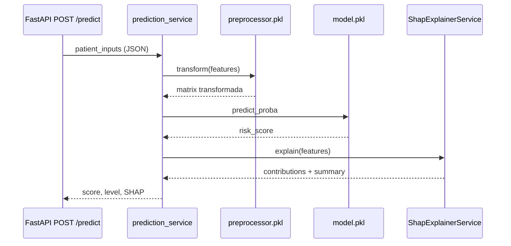

# MedScope AI — Pipeline de Machine Learning

Documentación académica del pipeline ML offline para la memoria del TFM (**RAC-010**).

**Trazabilidad:** T-201 → T-212 · [RIA-001–031](../Requirements/Requirements.md#7-requerimientos-ia--machine-learning) · [UC-110–112](../Use%20Cases/Use%20Cases.md#15-ml-lifecycle-cases) · [Execution Plan Fase 2](../Execution%20Plan/ExecutionPlan.md#phase-2--machine-learning-pipeline)

---

## 1. Objetivo

MedScope AI predice el **riesgo de readmisión hospitalaria a 30 días** en pacientes con diabetes, como apoyo a la decisión clínica (CDSS). El pipeline ML:

- se entrena **offline** (nunca en inferencia),
- garantiza **paridad train/inference** (RIA-010),
- prioriza **recall** sobre accuracy en la selección del modelo (RIA-012, EP-2.7),
- expone **explicaciones SHAP** interpretables (RIA-030, UC-030),
- serializa artefactos listos para el backend FastAPI (RIA-020, UC-082).

---

## 2. Metodología

### 2.1 Enfoque

Se sigue un flujo reproducible inspirado en CRISP-DM, acotado al MVP del TFM:

| Fase | Actividad | Entregable |
|---|---|---|
| Comprensión | Selección dataset público clínico | [datasets/README.md](../../datasets/README.md) |
| Exploración | EDA en notebook | `notebooks/diabetes130_eda.ipynb` |
| Preparación | Limpieza, features, split estratificado | `ml/preprocessing/` |
| Modelado | Baselines LR y Random Forest | `ml/training/` |
| Evaluación | Métricas hold-out, comparación, umbral | `ml/evaluation/` |
| Despliegue (offline) | Serialización + manifest | `models/model.pkl`, `model_manifest.json` |
| Explicabilidad | SHAP LinearExplainer | `ml/explainability/` |

### 2.2 Principios de ingeniería

- **Reproducibilidad:** `random_state=42`, split 80/20 estratificado, manifest con checksum SHA-256.
- **Separación de responsabilidades:** `preprocessing/`, `training/`, `evaluation/`, `explainability/`, `scripts/`.
- **Sin PHI:** dataset de-identificado; artefactos y CSV raw en `.gitignore`.
- **Tests automatizados:** suite RTS-010 en `ml/tests/` (carga, rangos, SHAP, métricas).

### 2.3 Diagrama del ciclo de vida


---

## 3. Dataset

### 3.1 Fuente

| Campo | Valor |
|---|---|
| **Nombre** | Diabetes 130-US hospitals for years 1999–2008 |
| **Proveedor** | [UCI ML Repository](https://archive.ics.uci.edu/dataset/296/diabetes+130-us+hospitals+for+years+1999-2008) |
| **Licencia** | CC BY 4.0 |
| **Filas** | 101.766 encuentros |
| **Columnas** | 50 |
| **Variable objetivo** | `readmitted` (`<30`, `>30`, `NO`) |

**Cita:** Strack, B., et al. (2014). *BioMed Research International*, 2014.

### 3.2 Definición del problema (MVP)

Etiqueta binaria **`readmit_30d`**: `1` si `readmitted == '<30'`, `0` en caso contrario.

| Clase | Encuentros | % aprox. |
|---|---|---|
| No readmitido (`NO` + `>30`) | 90.409 | ~88,8 % |
| Readmitido < 30 días | 11.357 | ~11,2 % |

El desbalance justifica `class_weight="balanced"` y la priorización de **recall**.

### 3.3 Descarga y validación

```bash
python ml/scripts/download_dataset.py
```

Metadatos: [`datasets/manifest.json`](../../datasets/manifest.json) (URL, columnas, distribución de clases, SHA-256).

### 3.4 Hallazgos EDA relevantes (T-202)

Documentados en `notebooks/diabetes130_eda.ipynb`. Gráficos exportados para defensa: `docs/figures/eda/` (T-214).

- Alta proporción de valores faltantes en `weight` (~97 %) → excluido del MVP.
- Códigos ICD (`diag_1`–`diag_3`) de alta cardinalidad → se usa `number_diagnoses`.
- Columnas individuales de medicación antidiabética → colapsadas en features derivadas.
- Duplicados por `patient_nbr` → deduplicación (primer encuentro por paciente).

---

## 4. Preprocesamiento y feature engineering

### 4.1 Limpieza (`ml/preprocessing/cleaning.py`)

1. Sustitución de placeholders (`?`, `None`, `Unknown`, …).
2. Parseo de `age` a `age_midpoint` (punto medio del bin ordinal).
3. Deduplicación por `patient_nbr`.
4. Creación de `readmit_30d`.
5. Feature engineering vía `apply_feature_engineering()`.

### 4.2 Features del modelo (19 variables)

| Grupo | Features |
|---|---|
| Numéricas base | `age_midpoint`, `time_in_hospital`, `num_medications`, `number_inpatient`, `number_outpatient`, `number_emergency`, `num_lab_procedures`, `num_procedures`, `number_diagnoses` |
| Derivadas (T-204) | `total_prior_visits`, `active_diabetes_meds_count`, `has_insulin`, `meds_per_day` |
| Categóricas | `gender`, `race`, `max_glu_serum`, `A1Cresult`, `change`, `diabetesMed` |

**Definiciones derivadas:**

- `total_prior_visits` = inpatient + outpatient + emergency previos.
- `active_diabetes_meds_count` = medicamentos antidiabéticos activos (≠ `No`).
- `has_insulin` = indicador binario de uso de insulina.
- `meds_per_day` = `num_medications / max(time_in_hospital, 1)`.

### 4.3 Pipeline sklearn (`Diabetes130Preprocessor`)

| Tipo | Pasos |
|---|---|
| Numéricas | Imputación mediana → `StandardScaler` |
| Categóricas | Imputación moda → `OneHotEncoder(handle_unknown="ignore")` |

Split: **80 % train / 20 % test**, estratificado sobre `readmit_30d`, `random_state=42`.

---

## 5. Modelos evaluados

### 5.1 Logistic Regression (baseline interpretable)

```python
LogisticRegression(class_weight="balanced", max_iter=1000, random_state=42)
```

- Ventaja: coeficientes lineales, SHAP `LinearExplainer`, baja latencia.
- Adecuado para CDSS con explicabilidad prioritaria.

### 5.2 Random Forest (baseline no lineal)

```python
RandomForestClassifier(
    class_weight="balanced",
    n_estimators=200,
    random_state=42,
    n_jobs=-1,
)
```

- Ventaja: mayor accuracy en umbral 0.5.
- Inconveniente: recall muy bajo en clase positiva; SHAP más costoso (`TreeExplainer`).

### 5.3 XGBoost (evaluación opcional, T-213)

```python
XGBClassifier(
    objective="binary:logistic",
    scale_pos_weight=<neg/pos del train split>,
    n_estimators=200,
    max_depth=6,
    learning_rate=0.1,
    random_state=42,
)
```

- Ventaja: captura no-linealidades; recall intermedio entre LR y RF.
- Inconveniente: no supera a LR en recall @ 0.5; SHAP `TreeExplainer` más costoso que `LinearExplainer`.
- **No promovido a producción:** el modelo final sigue siendo Logistic Regression (T-208).

```bash
python ml/scripts/train_xgboost.py
```

Reporte: `models/xgboost_evaluation.json` · Artefactos: `models/xgboost/`

### 5.4 Modelos fuera de alcance MVP

- **Deep learning:** fuera de alcance por simplicidad y tamaño del dataset tabular.

---

## 6. Evaluación y selección del modelo final

### 6.1 Protocolo (T-207)

- Métricas en **test hold-out** (nunca visto en entrenamiento).
- Umbral de decisión por defecto: **0.5**.
- Umbral alternativo optimizado para recall documentado pero **no adoptado** en producción (colapsa accuracy).
- KPI documentado: accuracy > 75 % (Requirements §15); **no alcanzado** por el modelo seleccionado.

### 6.2 Resultados en test (umbral 0.5)

| Métrica | Logistic Regression | Random Forest | XGBoost (T-213) |
|---|---|---|---|
| **Accuracy** | 0,607 | **0,822** | 0,665 |
| **Recall** | **0,542** | 0,201 | 0,439 |
| Precision | 0,119 | 0,142 | 0,119 |
| F1 | 0,195 | 0,166 | 0,188 |
| ROC-AUC | **0,610** | 0,593 | 0,588 |

Fuente reproducible: `models/evaluation_report.json` (LR/RF) y `models/xgboost_evaluation.json` (comparativa T-213).

### 6.3 Decisión de producción (T-208)

| Criterio | Decisión |
|---|---|
| **Modelo final** | `logistic_regression` v1.0.0 |
| **Umbral** | 0.5 |
| **SHAP** | `linear` (`LinearExplainer`) |
| **Motivo principal** | Mayor recall (0,54 vs 0,20): prioridad clínica de detectar readmisiones |
| **RF descartado** | Accuracy superior pero pierde ~80 % de positivos |
| **XGBoost descartado (T-213)** | Mejor que RF en recall (0,44 vs 0,20) pero inferior a LR (0,54) |

Documento de decisión: `models/final_model_selection.json`.

### 6.4 Categorías de riesgo (inferencia)

| Score | Nivel |
|---|---|
| &lt; 0,35 | `low` |
| 0,35 – 0,49 | `medium` |
| ≥ 0,50 (umbral producción) | `high` |

Implementación: `ml/explainability/explainer.py` → `classify_risk_level()`.

---

## 7. Explicabilidad (SHAP)

Módulo: `ml/explainability/`

| Componente | Función |
|---|---|
| `ShapExplainerService` | Carga modelo + preprocessor, calcula SHAP |
| `LinearExplainer` | Producción (LR seleccionado) |
| `TreeExplainer` | Soporte para RF si se promoviera en el futuro |
| `build_clinical_summary()` | Resumen textual neutro (RF-032) |

Flujo:

1. Transformar features con el mismo preprocessor de entrenamiento.
2. Calcular valores SHAP en espacio transformado.
3. Agregar contribuciones one-hot → feature clínica de entrada.
4. Devolver top-N factores con dirección (`increases_risk` / `decreases_risk`).

Demo reproducible:

```bash
python ml/scripts/compute_shap_demo.py
```

---

## 8. Serialización e inferencia

### 8.1 Artefactos de producción (T-209)

```bash
python ml/scripts/select_final_model.py   # requisito previo
python ml/scripts/serialize_model.py
```

| Archivo | Descripción |
|---|---|
| `models/model.pkl` | Clasificador final (joblib) |
| `models/preprocessor.pkl` | Pipeline ajustado |
| `models/model_manifest.json` | ID, versión, threshold, features, explainer SHAP |
| `models/shap_background.npy` | Muestra background SHAP serializada (inferencia sin dataset en Docker) |
| `models/final/` | Copia promovida del modelo seleccionado |

### 8.2 Diagrama de inferencia (integración backend)



**Reglas de inferencia (RIA-021, UC-082):**

- Cargar modelo **una vez** al arranque del backend (`lifespan`, T-301).
- Usar `shap_background.npy` para SHAP en producción (no requiere dataset en runtime).
- Nunca reentrenar en tiempo de petición.
- Latencia objetivo: **&lt; 1 s** por predicción (`prediction_time_ms` en respuesta).
- Endpoint implementado: `POST /predict` (T-304) — ver [Testing/Manual/Phase-03](../Testing/Manual/Phase-03-ML-Backend-Integration.md).

---

## 9. Estructura del código ML

```text
ml/
├── preprocessing/       # Limpieza, features, Diabetes130Preprocessor
├── training/            # LR, RF, serialización, constantes
├── evaluation/          # Métricas, reporte, selección, comparación
├── explainability/      # SHAP + resumen clínico
├── scripts/             # CLI reproducibles (train, evaluate, serialize, shap)
└── tests/               # RTS-010: load, range, SHAP, métricas
```

### Comandos reproducibles (orden recomendado)

```bash
python ml/scripts/download_dataset.py
python ml/scripts/train_logistic_regression.py
python ml/scripts/train_random_forest.py
python ml/scripts/train_xgboost.py          # opcional T-213
python ml/scripts/export_eda_figures.py     # T-214 defensa
python ml/scripts/evaluate_models.py
python ml/scripts/select_final_model.py
python ml/scripts/serialize_model.py
python ml/scripts/compute_shap_demo.py
pytest ml/tests -v
```

---

## 10. Conclusiones

### 10.1 Logros del pipeline MVP

1. Pipeline **completo y reproducible** desde dataset público hasta artefactos de inferencia.
2. Selección de modelo **justificada clínicamente** (recall > accuracy en CDSS).
3. **Explicabilidad SHAP** integrada con lenguaje clínico neutro.
4. **72 tests** en `ml/tests/` validando carga, rangos, métricas y SHAP (RTS-010).
5. Trazabilidad a requisitos RIA-*, UC-110–112 y fases T-201–T-213.

### 10.2 Limitaciones (honestidad académica)

| Limitación | Impacto | Mitigación futura |
|---|---|---|
| Accuracy ~61 % (&lt; KPI 75 %) | Más falsos positivos | Rebalanceo, umbral calibrado, más features |
| Precision baja (~12 %) | Alertas de riesgo ruidosas | Optimización precision-recall por contexto hospitalario |
| Dataset único (diabetes, EE.UU. 1999–2008) | Generalización limitada | Validación externa, otro centro |
| Sin `blood_pressure` / BMI fiable | Gap con formulario UI | Campos opcionales o imputación |
| Modelo lineal simple | No captura no-linealidades complejas | XGBoost evaluado (T-213); LR sigue líder en recall |

### 10.3 Mensaje para la defensa (RAC-001)

El valor del TFM no reside solo en el porcentaje de accuracy, sino en:

- arquitectura **enterprise** lista para integración,
- **explicabilidad** accionable para el clínico,
- **simulación what-if** (Fase 5),
- y un pipeline **auditable y reproducible** apto para entornos sanitarios regulados.

---

## 11. Referencias cruzadas

| Documento | Contenido relacionado |
|---|---|
| [datasets/README.md](../../datasets/README.md) | Detalle técnico del dataset y scripts |
| [Requirements §7](../Requirements/Requirements.md#7-requerimientos-ia--machine-learning) | RIA-001–031 |
| [Testing §8](../Testing/Testing.md#8-ml-tests-rts-010) | Estrategia de tests ML |
| [Execution Plan Fase 2](../Execution%20Plan/ExecutionPlan.md#phase-2--machine-learning-pipeline) | Roadmap de implementación |
| [skills/ml/SKILL.md](../../skills/ml/SKILL.md) | Convenciones de código ML |
| [skills/shap/SKILL.md](../../skills/shap/SKILL.md) | Convenciones SHAP |

---

*Última actualización: T-212 — documentación pipeline ML para memoria TFM (RAC-010).*
